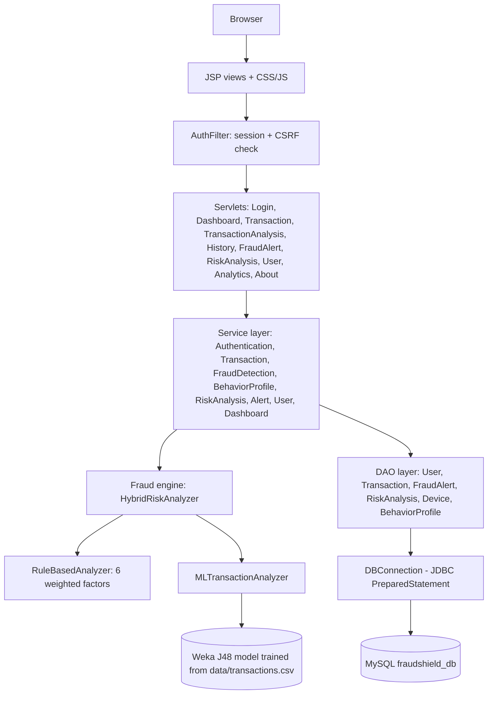
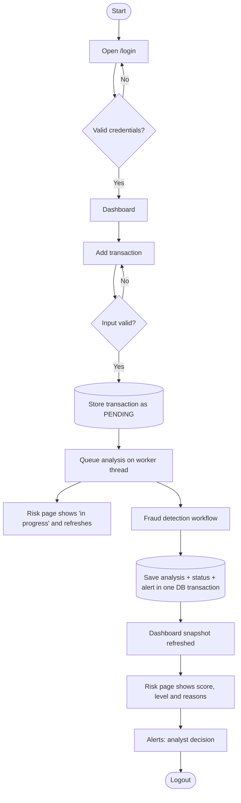
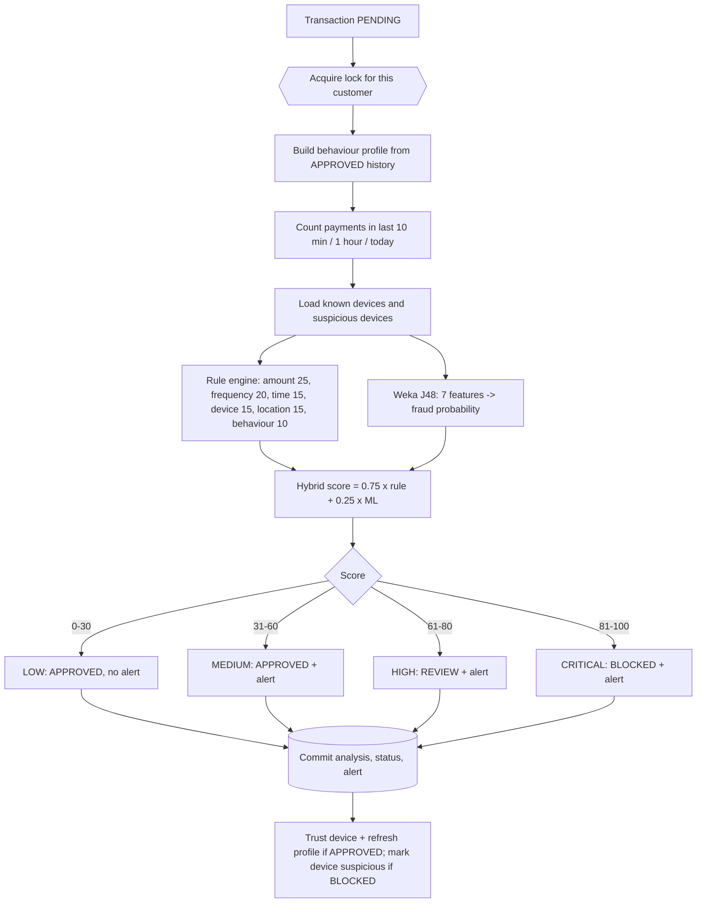
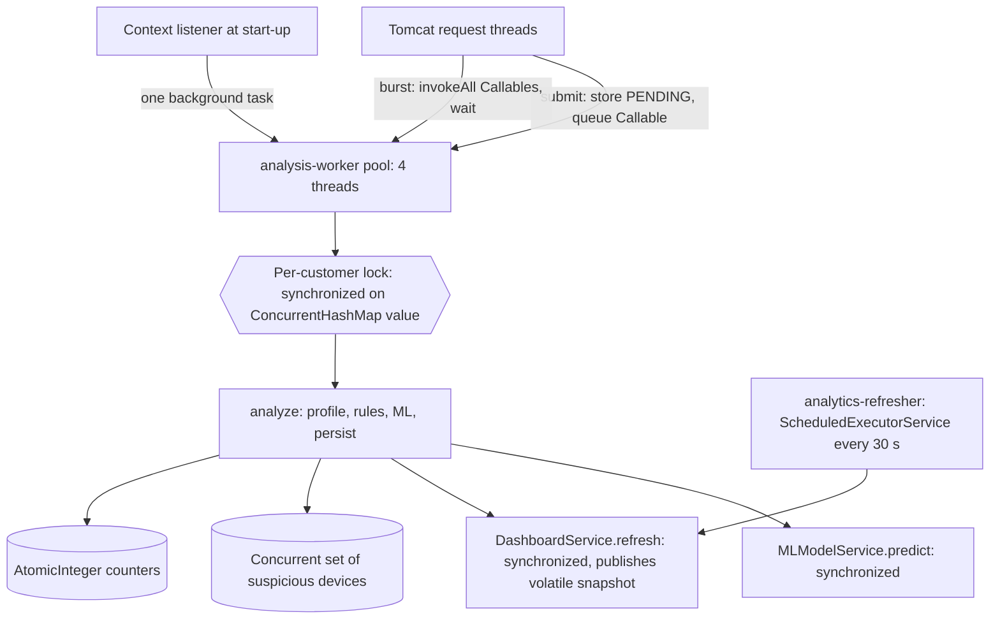
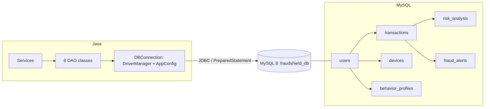
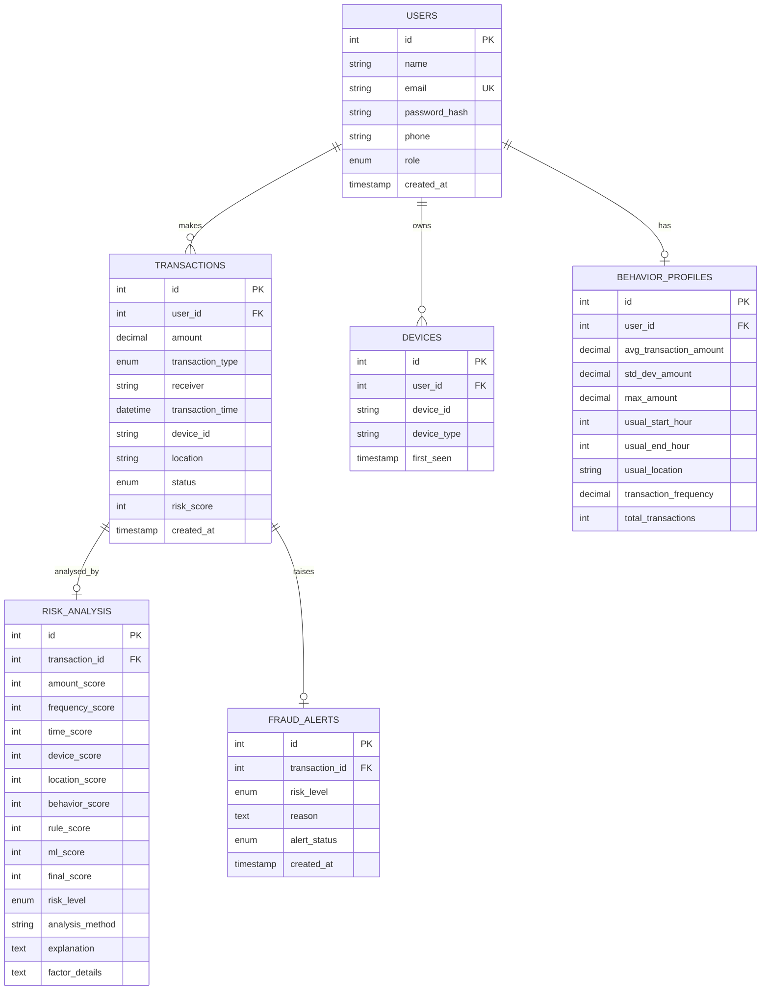
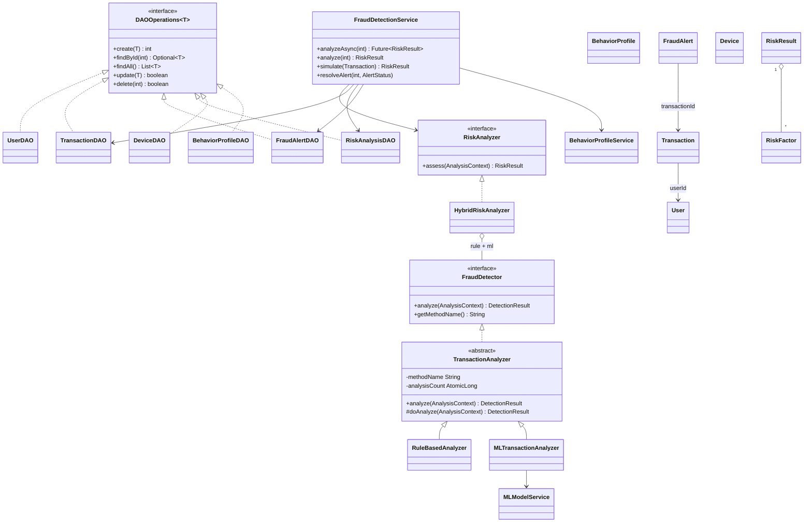

# FraudShield AI

**An Explainable AI-Powered UPI & Digital Payment Fraud Detection System**
Java web application (Servlets + JSP + JDBC + MySQL + Weka) - 3rd-semester B.Tech CSE project.

> This is an academic simulation. It uses synthetic data only and is **not** connected to UPI, any bank or any payment network.

**Contents of this repository**

| Path | What it is |
|---|---|
| `pom.xml` | Maven build (WAR, Java 17) |
| `src/main/java/com/fraudshield/...` | All Java source (64 files, about 4,300 lines) |
| `src/main/webapp/` | JSP pages, CSS, JS, `web.xml` |
| `src/main/resources/application.properties(.example)` | Database and engine configuration |
| `database/schema.sql`, `database/sample_data.sql` | MySQL schema, seed users, 130 synthetic transactions |
| `data/transactions.csv` | Synthetic ML dataset (2,000 rows) |
| `docs/` | architecture, database design, workflow, diagrams, rubric mapping, test plan, presentation content |
| `screenshots/` | Place your review screenshots here (checklist inside) |

---

## 1. Project Overview

FraudShield AI is a fraud analyst console for digital payments. A user (admin or analyst) enters a payment for a monitored customer. The system stores it in MySQL, compares it with that customer's own history, scores it with transparent rules and a Weka decision-tree model, and returns a **risk score from 0 to 100, a risk level and the exact reasons** behind the score. Suspicious payments raise alerts that an analyst can confirm or dismiss. Everything runs locally in the browser at `http://localhost:8080/FraudShieldAI/`.

## 2. Problem Statement

UPI and other digital payments settle in seconds and are hard to reverse. Fraud usually looks like *unusual behaviour for that customer*: a much larger amount than normal, a new device, a different city, a 3 a.m. payment, or many payments in a few minutes. Simple "fraud / not fraud" labels are not enough for an analyst, who needs to know **why** a payment was flagged before blocking a customer.

## 3. Motivation

* Digital-payment volumes keep growing, and so does the attack surface.
* Fixed global limits (for example "block above Rs 50,000") are blunt: they annoy customers who normally pay large amounts and miss small-but-strange payments.
* Black-box ML scores are hard to trust and hard to defend. A score that lists its reasons is easier to act on and easier to audit.
* The project lets a student demonstrate Core Java, OOP, collections, multithreading, JDBC, Servlets/JSP and a real ML library in one coherent system.

## 4. Objectives

1. Accept and validate simulated payment transactions and store them in MySQL.
2. Build a behaviour profile for every customer from their approved history.
3. Detect suspicious patterns with transparent, weighted rules.
4. Add a Weka machine-learning probability trained on a synthetic dataset.
5. Produce an explainable result (score, level, factor list, explanation, method, timestamp) for every transaction.
6. Raise alerts, let analysts decide, and show dashboards, history, analytics and user information.
7. Demonstrate OOP, collections, generics, exceptions, multithreading, synchronization, DAO/JDBC and Servlets in a layered design.

## 5. Proposed Solution

A layered Java web application: **JSP -> Servlet -> Service -> Fraud engine -> DAO -> JDBC -> MySQL**, with Weka inside the engine. The engine combines:

* **Rule-based detection** - six factors (amount, frequency, time, device, location, behaviour) with fixed weights.
* **Behavioural analysis** - each factor is judged against the customer's own average amount, usual hours, usual location, known devices and known receivers.
* **Weka J48 model** - a decision tree trained on `data/transactions.csv` returns a fraud probability.

Final score = 75% rule score + 25% ML probability. The rule factors supply the explanation; the ML number is shown beside them.

## 6. Key Features

* Login with salted password hashes, session authentication, lock-out after repeated failures, CSRF token on every POST.
* Dashboard: total, suspicious, high, critical, average risk score, open alerts, recent alerts and transactions, risk distribution.
* Add transaction with **asynchronous analysis** and a self-refreshing result page.
* **Transaction Analysis** page: "what-if" scoring that stores nothing.
* **Rapid burst simulator**: stores several payments and analyses them concurrently.
* History with search, filters (level, status, type, date, amount) and paging; admin delete.
* Fraud alerts with analyst decisions (investigating, confirmed fraud, false positive) that update the transaction.
* Risk analysis page with score, risk meter, ticked detection factors, weighted breakdown, ML summary, method and timestamp.
* Analytics: risk levels, average factor scores, transactions by hour, by type, by location, Weka evaluation and the learned tree.
* Users page with behaviour profile and trusted devices; admin can add/delete users and register devices.
* Graceful error pages, including a database outage.

## 7. Complete Technology Stack

| Area | Technology |
|---|---|
| Language | Java 17 (Core Java, OOP, collections, generics, concurrency) |
| Web | Java Servlet 4.0 (`javax.servlet`), JSP 2.3, JSTL 1.2, EL, HTML5, CSS3, small vanilla JavaScript |
| Server | Apache Tomcat 9.0.x (Tomcat 10+ uses `jakarta.*` and will not run this WAR) |
| Database | MySQL 8.x, JDBC with MySQL Connector/J 8.3.0 |
| Machine learning | Weka 3.8.6 (`weka-stable`), J48 decision tree |
| Build | Maven 3.9.x (WAR packaging), optional Cargo plugin for one-command run |

No Spring, no Python, no Node, no external web service. Charts are drawn with plain HTML/CSS so the demo works offline.

## 8. System Architecture

```
Browser
  -> JSP / HTML / CSS / JS            (webapp/WEB-INF/views, css, js)
  -> AuthFilter                        (session + CSRF)
  -> Servlet                           (servlet/*)         thin: parse, call service, forward/redirect
  -> Service                           (service/*)         business rules, threading, JDBC transactions
  -> Fraud Detection Engine            (analysis/*)        HybridRiskAnalyzer = RuleBasedAnalyzer + MLTransactionAnalyzer
  -> DAO                               (dao/*)             one per table, all SQL here
  -> JDBC                              (db/DBConnection)   PreparedStatement, ResultSet, try-with-resources
  -> MySQL                             (fraudshield_db)
  -> Weka ML                           (MLModelService)    trained at start-up from data/transactions.csv
```



## 9. Complete Application Workflow

Login -> Dashboard -> Transaction Entry -> Validation -> Database Storage -> Behavioural Analysis -> Rule-Based Detection -> ML Analysis -> Risk Scoring -> Explainable Result -> Fraud Alert -> Dashboard Update.

1. **Login** - `LoginServlet` checks the e-mail and password hash through `AuthenticationService`, creates a new session and a CSRF token.
2. **Dashboard** - `DashboardServlet` shows the cached statistics snapshot.
3. **Transaction entry** - `TransactionServlet` reads the form; the browser helps with preset examples.
4. **Validation** - `TransactionService.validate` checks amount (0 < amount <= Rs 10,00,000), payment type, receiver (UPI ids must look like `name@bank`), device id, location, time (not more than a day ahead) and that the customer exists. Failures throw `InvalidTransactionException` and the form is shown again with the message.
5. **Database storage** - `TransactionDAO.create` inserts the row with status `PENDING`.
6. **Analysis queued** - the service submits a `Callable` to the worker pool and the browser is redirected to the risk page.
7. **Behavioural analysis** - `BehaviorProfileService` builds the profile from the customer's `APPROVED` history.
8. **Rule-based detection** - `RuleBasedAnalyzer` scores the six factors.
9. **ML analysis** - `MLTransactionAnalyzer` asks the Weka model for a fraud probability.
10. **Risk scoring** - `HybridRiskAnalyzer` blends the scores and classifies the level.
11. **Explainable result** - a `RiskResult` with factors and explanation is built.
12. **Persistence and alert** - analysis, new status and (for MEDIUM and above) the alert are saved in **one JDBC transaction**.
13. **Dashboard update** - the dashboard snapshot is refreshed; the risk page stops refreshing and shows the result.



## 10. Fraud Detection Workflow

1. Take the customer's lock so their transactions are analysed one at a time (their results depend on each other).
2. Build the behaviour profile: average, standard deviation and maximum amount, usual hours (5th to 95th percentile), usual location (most frequent), known locations and receivers, payment-type counts, payments per active day.
3. Count the customer's earlier payments in the 10 minutes, the hour and the day before this payment.
4. Load the customer's known devices and the global set of suspicious devices (devices used in blocked payments).
5. Score six factors from 0 to 100 (section 11).
6. Compute the Weka probability from seven features: `amount, amount_ratio, transaction_frequency, hour, device_new, location_changed, behavior_deviation`.
7. Final score = round(0.75 x rule + 0.25 x ML). If the model is not available the rule score is used alone and the result says so.
8. Level: 0-30 LOW, 31-60 MEDIUM, 61-80 HIGH, 81-100 CRITICAL.
9. Status: LOW and MEDIUM -> APPROVED, HIGH -> REVIEW, CRITICAL -> BLOCKED. MEDIUM and above create an alert.
10. After commit: an APPROVED payment makes its device trusted and refreshes the profile snapshot; a BLOCKED payment marks its device suspicious.



## 11. Risk Scoring Methodology

Each factor gets a score from 0 (normal) to 100 (very abnormal). Contribution = score x weight / 100. The rule score is the sum of the contributions.

| Factor | Weight | How the factor score is decided (`RuleBasedAnalyzer`) |
|---|---|---|
| Amount anomaly | 25% | Ratio = amount / customer's average. <= 2x: 0; <= 3x: 30; <= 5x: 60; <= 10x: 85; above: 100. At least 70 if amount >= Rs 1,00,000. With too little history: absolute limits (>= 20,000: 40; >= 50,000: 70; >= 1,00,000: 100). |
| Frequency anomaly | 20% | Payments in the previous 10 minutes: 0 -> 0, 1 -> 40, 2 -> 70, 3 or more -> 100. Also compares payments today with the customer's usual per-day rate (ratio > 2: 30, > 3: 60, > 4: 80). The higher value is used. |
| Time anomaly | 15% | Hour inside the customer's usual window: 0. Outside: 30 + 15 points per hour of distance (max 100). Night (00:00-04:59) outside the usual window: at least 80. |
| Device anomaly | 15% | Known trusted device: 0. New device: 70. Device used in a blocked payment: 90. Both: 100. |
| Location anomaly | 15% | Usual location: 0. Different but seen before: 25. Never seen: 100. |
| Behaviour deviation | 10% | New receiver +50; amount above 1.5 x the largest previous payment +30; rarely used payment type (< 10% of history) +20 (max 100). |

* A factor is "triggered" (shown with a tick) when its score is 40 or more.
* The customer needs at least **5 approved transactions** (`BehaviorProfile.MIN_HISTORY`) before behavioural comparisons are used; before that the engine falls back to conservative absolute limits and says so.
* **Blend:** `final = 0.75 x rule score + 0.25 x ML probability x 100` (configurable in `application.properties`).
* **Levels:** 0-30 LOW, 31-60 MEDIUM, 61-80 HIGH, 81-100 CRITICAL (`RiskLevel.fromScore`).

Worked example (real output from the development run, TXN1132): amount 25.8x average -> 100 x 25% = 25.0; unusual time -> 15.0; new location -> 15.0; new device -> 10.5; new receiver + larger than any previous payment -> 8.0; rule score 74; ML probability 89%; final = 0.75 x 74 + 0.25 x 89 = 78 -> HIGH.

## 12. Explainable AI

The system never reports only "ML = fraud". Every analysis is a `RiskResult` holding:

* `finalScore`, `riskLevel`
* the list of `RiskFactor` objects (code, name, score, weight, plain-English description, contribution)
* `ruleScore`, `mlScore` and an ML summary sentence
* `explanation` (headline plus one ticked line per triggered factor, biggest contribution first)
* `analysisMethod` and `analyzedAt`

The text is built from the same numbers that produce the score, so the explanation cannot disagree with the result. The ML model is the only non-transparent part; its probability is displayed separately and its learned decision tree can be inspected on the Analytics page.

Example (real output, seeded TXN1125):

```
Risk score 93/100 (CRITICAL). Rule score 94, ML probability 89%.
✓ Transaction amount (Rs 18,000) is 6.8x the customer's normal average (Rs 2,655) (+21.3 points)
✓ Multiple transactions detected within a short interval (3 in the previous 10 minutes) (+20.0 points)
✓ Transaction occurred at an unusual time (03:00; customer normally pays between 10:00 and 19:00) (+15.0 points)
✓ New device detected, and it was used in a previously blocked transaction (+15.0 points)
✓ Location differs from historical behaviour: Kolkata (usual: Delhi) (+15.0 points)
✓ Deviation from historical behaviour: new/unknown beneficiary, larger than any previous payment (+8.0 points)
```

## 13. OOP Concepts

| Concept | Where | Notes |
|---|---|---|
| Encapsulation | `model/User`, `Transaction`, `RiskFactor`, `BehaviorProfile`, `RiskResult` | Private fields; validating setters (`User.setEmail`, `User.setRole`, `RiskResult.setFinalScore` clamps 0-100 and derives the level); `RiskResult.getFactors()` returns an unmodifiable list |
| Inheritance | `TransactionAnalyzer` (abstract) -> `RuleBasedAnalyzer`, `MLTransactionAnalyzer`; `BaseServlet` -> all servlets; custom exceptions extend `Exception` | Shared behaviour lives once in the parent |
| Abstraction | `abstract class TransactionAnalyzer` with the abstract `doAnalyze()`; `analyze()` is `final` (Template Method) | Subclasses cannot skip validation or counting |
| Interfaces | `FraudDetector`, `RiskAnalyzer`, `DAOOperations<T>` | Contracts between layers |
| Polymorphism | `HybridRiskAnalyzer` calls `FraudDetector` references (rule or ML) without knowing the class; `FraudDetectionService` depends on `RiskAnalyzer`; all DAOs share `DAOOperations<T>` | Runtime dispatch of `analyze()` |
| Exception handling | `InvalidTransactionException`, `DatabaseOperationException`, `AuthenticationException`, `FraudAnalysisException`; `SQLException` is caught in DAOs and wrapped; servlets turn exceptions into HTTP status + friendly pages; `HybridRiskAnalyzer` deliberately catches the ML failure and falls back to rules | No stack traces reach the browser |
| Composition | `HybridRiskAnalyzer` has two detectors; `RiskResult` has many `RiskFactor` | |

## 14. Collections & Generics

| Type | Where | Why |
|---|---|---|
| `List<Transaction>` / `ArrayList` | `TransactionDAO.list/search/findRecent`, `TransactionService.submitBurst` | Ordered query results |
| `List<RiskFactor>` | `RiskResult`, `DetectionResult`, `RuleBasedAnalyzer` | Ordered factors; returned as an unmodifiable list |
| `Map<String,Integer>` / `HashMap` | `BehaviorProfileService` (location -> count), `BehaviorProfile.typeCounts`, `TransactionDAO.getRiskCounts`, `DashboardStats.levelCounts` | Counting and grouping |
| `Map<Integer,Object>` / `ConcurrentHashMap` | `FraudDetectionService.userLocks` | One lock object per customer, safe for many threads |
| `Map<String,Integer>` / `ConcurrentHashMap` | `AuthenticationService.failedAttempts` | Failed-login counters |
| `LinkedHashMap` | `TransactionDAO.countByHour/statsByType`, `RiskAnalysisDAO.averageFactorScores` | Keeps display order |
| `Set<String>` / `HashSet` | `BehaviorProfile.knownLocations/knownReceivers`, `DeviceDAO.findDeviceIdsByUser`, `BehaviorProfileService` (distinct active days `Set<LocalDate>`) | Fast "have we seen this before?" checks |
| `Set<String>` concurrent | `FraudDetectionService.suspiciousDevices` (`ConcurrentHashMap.newKeySet()`) | Shared by all worker threads |
| `Optional<T>` | every `findById` | Explicit "not found" |
| `Collections.sort`, `Comparator` | `BehaviorProfileService` (hours percentile), `HybridRiskAnalyzer` (biggest contribution first) | Sorting |
| **Generics** | `DAOOperations<T>` implemented by 6 DAOs; `PageResult<T>`; `Future<RiskResult>`, `Callable<RiskResult>`; `Optional<T>`; `Map<Integer,String>` for form hints | Type-safe reuse |

## 15. Multithreading & Synchronization

| Thread / task | Purpose | Shared resource | Synchronization |
|---|---|---|---|
| `analysis-worker-1..4` (`AppExecutors.analysisPool`, fixed pool) running `FraudDetectionService.analyze` as a `Callable<RiskResult>` | Analyse payments without blocking the web request | A customer's history, profile and velocity counters; DB rows | `synchronized (lock)` where `lock` is the customer's object from `ConcurrentHashMap<Integer,Object> userLocks`; different customers run in parallel |
| Burst task (`TransactionService.submitBurst`) | Concurrent transaction processing demo: payments are stored in order, then analysed with `invokeAll(List<Callable>)` and the request waits for all `Future`s | Same as above | Per-customer lock keeps the analyses consistent; ids are assigned before the threads start, so "earlier payment" is well defined |
| Start-up task (`AppContextListener`) | Train the Weka model, then analyse any PENDING transactions (sample data / crash recovery) | The model; the database | `MLModelService.train()` is `synchronized`; the finished model is published through a `volatile` field |
| `analytics-refresher` (`ScheduledExecutorService`, every 30 s) | Recompute dashboard statistics in the background | The cached `DashboardStats` | `DashboardService.refresh()` is `synchronized`; the snapshot is a `volatile` reference to an object that is never modified after publication |
| Prediction calls | Weka classifiers are not documented as thread-safe | The J48 object | `MLModelService.predictFraudProbability` is `synchronized` |
| Counters | Statistics | `analysedCount` (`AtomicInteger`), `TransactionAnalyzer.analysisCount` (`AtomicLong`) | Atomic classes, no locks needed |

**Safe transaction status:** a payment is `PENDING` until the worker finishes. Status, score, analysis row and alert are written in one JDBC transaction (`setAutoCommit(false)`, `commit`, `rollback` on error), so a reader never sees "analysed but still PENDING". `analyze()` is idempotent: if the payment is no longer PENDING the stored result is returned. The per-customer lock is taken before any shared state is read and `DashboardService.refresh()` never takes a customer lock, so the two locks cannot deadlock. Pools use daemon threads and are shut down in `contextDestroyed`.



## 16. Servlet/Web Architecture

| Servlet | URL | Methods | Responsibility | JSP |
|---|---|---|---|---|
| `LoginServlet` | `/login` | GET, POST | Show form; authenticate; invalidate old session (prevents fixation); store user and CSRF token | `login.jsp` |
| `LogoutServlet` | `/logout` | GET | Invalidate session | - |
| `DashboardServlet` | `/dashboard`, `/` | GET | Statistics snapshot, model status | `dashboard.jsp` |
| `TransactionServlet` | `/transactions/add` | GET, POST | Form; save + async analysis; rapid burst | `add-transaction.jsp` |
| `TransactionAnalysisServlet` | `/analyze` | GET, POST | Dry-run analysis, nothing stored | `analyze.jsp` |
| `TransactionHistoryServlet` | `/history` | GET, POST | Search/filter/paging; admin delete | `transaction-history.jsp` |
| `FraudAlertServlet` | `/alerts` | GET, POST | List and filter alerts; record analyst decision | `fraud-alerts.jsp` |
| `RiskAnalysisServlet` | `/risk?id=` or `?ref=TXN1024` | GET | One explainable analysis; auto-refresh while PENDING; 404 if unknown | `risk-analysis.jsp` |
| `AnalyticsServlet` | `/analytics` | GET | Charts data and model report | `analytics.jsp` |
| `UserServlet` | `/users`, `/users?id=` | GET, POST | List users, customer detail, admin add/delete user and register device | `users.jsp`, `user-detail.jsp` |
| `AboutServlet` | `/about` | GET | Project page | `about.jsp` |

Supporting web components: `BaseServlet` (render, flash messages, error handling), `AuthFilter` (login gate, UTF-8, CSRF), `AppContextListener` (start-up/shutdown), `web.xml` (session cookie flags, JSP rules, error pages). JSP files live under `WEB-INF/views`, so they cannot be opened directly by URL. Servlets contain no SQL and no scoring logic.

## 17. JDBC Architecture

* **`DBConnection`** loads the driver named in configuration and returns `DriverManager.getConnection(url, user, password)`; credentials come only from `AppConfig`.
* **DAO classes** (`UserDAO`, `TransactionDAO`, `FraudAlertDAO`, `RiskAnalysisDAO`, `DeviceDAO`, `BehaviorProfileDAO`) implement `DAOOperations<T>`: `create`, `findById`, `findAll`, `update`, `delete`, plus domain methods such as `findByEmail`, `search`, `countInWindow`, `updateStatusAndScore`, `findFiltered`, `save` (upsert).
* **`PreparedStatement` everywhere**: user input only ever reaches SQL through `?` placeholders. The dynamic search in `TransactionDAO.buildWhere` appends only fixed SQL fragments and binds values.
* **`ResultSet`** is mapped to model objects in private `map()` methods.
* **try-with-resources** closes every `Connection`, `PreparedStatement` and `ResultSet`.
* **`SQLException`** is caught in the DAO and re-thrown as `DatabaseOperationException`.
* **JDBC transaction**: `FraudDetectionService.persist` calls `RiskAnalysisDAO.save(conn, ...)`, `TransactionDAO.updateStatusAndScore(conn, ...)` and `FraudAlertDAO.create(conn, ...)` on one connection with `setAutoCommit(false)`.
* **CRUD** is implemented for users, transactions, alerts, devices and profiles (see rubric mapping).

## 18. Database Design

| Table | Meaning | Relationships |
|---|---|---|
| `users` | Staff (ADMIN, ANALYST) and monitored customers (CUSTOMER) | parent table |
| `transactions` | Simulated payments; `risk_score` NULL until analysed; status PENDING/APPROVED/REVIEW/BLOCKED | many-to-one with users |
| `risk_analysis` | One row per transaction: six factor scores, rule score, ML score, final score, level, method, explanation, factor details | one-to-one with transactions |
| `fraud_alerts` | One alert per MEDIUM/HIGH/CRITICAL transaction; status OPEN/INVESTIGATING/CONFIRMED_FRAUD/FALSE_POSITIVE | one-to-one with transactions |
| `devices` | Trusted devices of a customer; UNIQUE (user_id, device_id) | many-to-one with users |
| `behavior_profiles` | Latest behaviour snapshot per customer; UNIQUE user_id | one-to-one with users |

All foreign keys use `ON DELETE CASCADE`. Constraints: UNIQUE e-mail, CHECK amount > 0, CHECK score 0-100, ENUM columns, indexes on user/time, status, score and device. Full details: `docs/database-design.md`.



## 19. ER Diagram



## 20. Class Diagram



## 21. Application Flowchart


## 22. Fraud Detection Flowchart


## 23. ML/Weka

* **Dataset** - `data/transactions.csv`, 2,000 rows, **synthetic**, produced by `util.DatasetGenerator` (fixed random seed 2026, so it is reproducible). Features are drawn from plausible distributions (mostly normal behaviour, some abnormal bursts); the fraud label is drawn from a noisy logistic function of the features, so the classes overlap. About 11% of rows are fraud (217 of 2,000).
* **Features** - `amount`, `amount_ratio` (amount / customer's average), `transaction_frequency` (payments in the previous hour), `hour`, `device_new`, `location_changed`, `behavior_deviation` (the 0-100 behaviour score); target `fraud` (0/1).
* **Preprocessing** - the CSV is read with Java I/O into a Weka `Instances` object (numeric attributes plus a nominal class). No scaling is needed for a decision tree. Malformed rows are skipped.
* **Model** - `weka.classifiers.trees.J48` (C4.5 decision tree), minimum 5 rows per leaf, Laplace smoothing so leaf probabilities are not exactly 0 or 1.
* **Training** - `MLModelService.train()` runs once at application start on a background thread: 70/30 hold-out split (seed 42), 10-fold cross-validation, then a final model on all rows.
* **Prediction** - `MLTransactionAnalyzer` builds the same seven features for a live transaction and calls `distributionForInstance`; the fraud probability x 100 is the ML score.
* **Evaluation** - computed at start-up and shown on **Analytics**: accuracy, fraud precision/recall/F1, confusion counts and cross-validated ROC area. Verification run (same numbers with a Weka 3.7.11 jar and with classes compiled from the Weka 3.8 source): hold-out accuracy 91.2%, fraud precision 55.3%, recall 36.8%; 10-fold accuracy 92.0%, precision 68.4%, recall 47.9%, ROC area 0.877. **These are results on synthetic data; they say nothing about real fraud.** Always quote the figures your own run shows on the Analytics page.
* **Why the ML weight is only 25%** - the model is modest (recall under 50%), and the rule score is the explainable part.
* **Integration** - `ServiceRegistry` creates `MLModelService`; `MLTransactionAnalyzer` is one of the two `FraudDetector`s used by `HybridRiskAnalyzer`. If training fails (for example the CSV is missing) the engine still works with rules only.
* Regenerate the dataset: `java -cp target/classes com.fraudshield.util.DatasetGenerator data/transactions.csv 2000`, then rebuild.

## 24. Project Folder Structure

```
FraudShieldAI/
├── pom.xml                         Maven build (WAR); copies data/ onto the classpath
├── README.md
├── database/
│   ├── schema.sql                  database, 6 tables, seed users and devices
│   └── sample_data.sql             130 synthetic PENDING transactions (analysed at start-up)
├── data/transactions.csv           Weka training dataset (synthetic)
├── docs/                           architecture, database-design, workflow, diagrams, rubric-mapping,
│                                   test-plan, presentation-content
├── screenshots/                    your screenshots (checklist in README.md there)
└── src/main/
    ├── java/com/fraudshield/
    │   ├── model/       User, Transaction, Device, BehaviorProfile, FraudAlert, RiskFactor, RiskResult,
    │   │                RiskLevel, TransactionStatus, AlertStatus, TransactionFilter, PageResult, DashboardStats
    │   ├── dao/         DAOOperations<T>, UserDAO, TransactionDAO, FraudAlertDAO, RiskAnalysisDAO,
    │   │                DeviceDAO, BehaviorProfileDAO
    │   ├── db/          DBConnection
    │   ├── analysis/    FraudDetector, RiskAnalyzer, TransactionAnalyzer, RuleBasedAnalyzer,
    │   │                MLTransactionAnalyzer, HybridRiskAnalyzer, MLModelService, AnalysisContext,
    │   │                DetectionResult, RiskWeights
    │   ├── service/     AuthenticationService, TransactionService, FraudDetectionService,
    │   │                BehaviorProfileService, RiskAnalysisService, AlertService, UserService,
    │   │                DashboardService, AppExecutors, ServiceRegistry
    │   ├── servlet/     11 servlets, BaseServlet, AppContextListener
    │   ├── filter/      AuthFilter
    │   ├── exception/   4 custom exceptions
    │   └── util/        AppConfig, PasswordUtil, ValidationUtil, DateUtil, DatasetGenerator
    ├── resources/       application.properties, application.properties.example
    └── webapp/
        ├── css/style.css, js/app.js, index.jsp
        └── WEB-INF/     web.xml, views/*.jsp, views/fragments/*.jspf
```

## 25. Installation Requirements

| Software | Version | Check with |
|---|---|---|
| JDK | 17 or newer (project compiles with `--release 17`) | `java -version`, `javac -version` |
| Apache Maven | 3.8 or newer (3.9.x recommended) | `mvn -v` |
| MySQL Server | 8.0 or newer | `mysql --version` |
| Apache Tomcat | **9.0.x** (not 10 or 11) | download the "Core" zip/tar.gz from tomcat.apache.org |
| Browser | any current Chrome, Edge or Firefox | |
| Weka | nothing to install - Maven downloads `weka-stable` 3.8.6 | |
| Internet | needed once, for Maven to download dependencies (and Tomcat if you use Cargo) | |

**Verification status (please read).** A strict verification pass was run in a Linux sandbox (OpenJDK 21 compiling with `--release 17`, MySQL 8.0.46, Tomcat 9.0.118 embedded). What was actually executed:

* All 64 Java sources compile with `--release 17` against the real Servlet 4.0.1 API and against the real Weka 3.8 source code (official Waikato `weka-3.8` repository snapshot).
* Maven 3.8.7 built a `FraudShieldAI.war` from this project's `pom.xml` structure (64 classes at Java 17 bytecode, 13 JSP files, `web.xml`, `data/transactions.csv` and `application.properties` inside `WEB-INF/classes`), and that WAR's contents were started on Tomcat 9 and used end to end.
* Every page, the full login -> transaction -> asynchronous analysis -> alert -> dashboard/history flow, the JDBC commit/rollback, the Weka training and prediction, security checks and database constraints were exercised (details in `docs/test-plan.md` and `docs/verification-report.md`).

What was **not** possible there: the sandbox cannot reach Maven Central, so the exact command `mvn clean package` with the exact `pom.xml` versions (compiler plugin 3.11.0, war plugin 3.4.0, `weka-stable` 3.8.6, `mysql-connector-j` 8.3.0, `jstl` 1.2, JSP API 2.3.3, Cargo plugin) has **not** been run. The sandbox build used Debian's offline plugin versions (compiler 3.10.1, war 3.3.2) and substituted dependencies. MySQL Connector/J was replaced by a MariaDB JDBC driver for the runtime tests (same SQL). The first `mvn clean package` on your machine is therefore the first run of the exact pom; the troubleshooting table in section 35 covers likely problems.

## 26. MySQL Setup

Windows: install MySQL Server and MySQL Command Line Client (MySQL Installer). Ubuntu: `sudo apt install mysql-server`. macOS: `brew install mysql && brew services start mysql`.

```sql
-- 1. Create the schema, tables and seed users (WARNING: drops an existing fraudshield_db!)
--    From a normal terminal in the project folder:
mysql -u root -p < database/schema.sql

-- 2. Load the 130 synthetic sample transactions
mysql -u root -p fraudshield_db < database/sample_data.sql

-- 3. (Recommended) create a dedicated database user instead of using root
mysql -u root -p
CREATE USER 'fraudshield'@'localhost' IDENTIFIED BY 'choose_a_strong_password';
GRANT ALL PRIVILEGES ON fraudshield_db.* TO 'fraudshield'@'localhost';
FLUSH PRIVILEGES;

-- 4. Check
USE fraudshield_db;
SHOW TABLES;                       -- 6 tables
SELECT COUNT(*) FROM users;        -- 7
SELECT COUNT(*) FROM transactions; -- 130
```

The sample transactions are inserted as `PENDING`. The first time the web application starts it analyses them in time order with the real risk engine (a few seconds), which creates the risk analyses, alerts and behaviour profiles. If you reload `sample_data.sql`, restart Tomcat (or re-deploy) so they are analysed again.

## 27. Configuration

All settings are in `src/main/resources/application.properties` (a template is in `application.properties.example`; the file is git-ignored so your password is never committed).

```properties
db.driver=com.mysql.cj.jdbc.Driver
db.url=jdbc:mysql://localhost:3306/fraudshield_db?useSSL=false&allowPublicKeyRetrieval=true&serverTimezone=Asia/Kolkata
db.user=fraudshield              # your MySQL user
db.password=choose_a_strong_password
risk.rule.weight=0.75            # blend of rule score and ML score
risk.ml.weight=0.25
analysis.threads=4               # worker threads
analytics.refresh.seconds=30
auth.max.failed.attempts=5
auth.lock.minutes=5
```

**Edit the file before running `mvn clean package`** - it is packaged into the WAR. Alternatively leave placeholders in the file and set environment variables before starting Tomcat; they override the file: `FRAUDSHIELD_DB_URL`, `FRAUDSHIELD_DB_USER`, `FRAUDSHIELD_DB_PASSWORD` (pattern: `FRAUDSHIELD_` + key in upper case with dots replaced by underscores). The shipped file contains `db.password=CHANGE_ME` on purpose; the application will report "database is not reachable" until you change it.

## 28. Running the Project Locally

**Option A - Maven + Tomcat (classic)**

```bash
# in the project folder (the one containing pom.xml)
mvn clean package
# result: target/FraudShieldAI.war
```

1. Download and unzip Tomcat 9 (for example to `C:\tomcat9` or `~/tomcat9`).
2. Copy `target/FraudShieldAI.war` into Tomcat's `webapps/` folder.
3. Start Tomcat: `bin\startup.bat` (Windows) or `bin/startup.sh` (Linux/macOS). If you use environment variables for the DB settings, set them in the same terminal first.
4. Watch `logs/catalina.out` (or the console). You should see: `Weka model status: READY` and `Start-up analysis finished: 130 pending transaction(s) analysed`.
5. Open the URL in section 29.
6. Stop with `bin\shutdown.bat` / `bin/shutdown.sh`.

**Option B - one command (Maven downloads and runs Tomcat 9 for you)**

```bash
mvn clean package cargo:run
```

Leave the terminal open; press `Ctrl+C` to stop. Environment variables set in that terminal are passed to the application.

**Option C - IDE** - import as a Maven project in IntelliJ IDEA / Eclipse / VS Code, add a Tomcat 9 server and deploy the `FraudShieldAI:war exploded` artifact with context path `/FraudShieldAI`.

## 29. Localhost URL

**http://localhost:8080/FraudShieldAI/**

(`/FraudShieldAI` is the WAR file name. If you rename the WAR, the URL changes. If port 8080 is busy, change Tomcat's connector port in `conf/server.xml`.)

## 30. Sample Login Credentials

| Role | E-mail | Password | Can do |
|---|---|---|---|
| ADMIN | `admin@fraudshield.local` | `Admin@123` | Everything, including add/delete users, register devices, delete transactions |
| ANALYST | `analyst@fraudshield.local` | `Analyst@123` | Everything except admin actions (users, deletes) |

Customer accounts (`rahul.sharma@example.com`, `priya.verma@example.com`, `amit.patel@example.com`, `sneha.iyer@example.com`, `rohan.gupta@example.com`) are *monitored account holders*; they cannot sign in. These are demo passwords for a local simulation - change them for any other use.

## 31. Complete Demo Workflow (for the faculty review)

1. **Start** Tomcat; show the log lines `Weka model status: READY` and the start-up analysis. Open the URL.
2. **Login** as admin. (Optional: show a wrong password - HTTP 401 message - and that opening `/dashboard` while logged out returns to login.)
3. **Dashboard** - point out 130 transactions, a few suspicious ones, open alerts, risk distribution, "Detection engine" panel showing the trained model.
4. **Alerts** - open the CRITICAL alert for Rahul Sharma (seeded: four rapid, large payments at 03:xx from an unknown device in Kolkata). Click its transaction id.
5. **Risk analysis page** - explain the score, the risk meter, the ticked reasons, the weight table, rule score vs ML probability, method and timestamp.
6. **Transaction Analysis (dry run)** - choose Rahul, click *Fill normal example*, *Analyze*: LOW with "No risk factor was triggered". Then *Fill suspicious example*, *Analyze*: HIGH/CRITICAL with reasons. Show that nothing was stored (Dashboard total unchanged).
7. **Add transaction** - choose Priya, click *Fill suspicious example*, change amount if you like, *Save and analyze*. Show the "Analysis in progress" page that refreshes itself (background thread), then the result. Mention: PENDING -> analysed in one JDBC transaction.
8. **Normal payment** - add a normal payment for Rahul (Rs 2,400, `swiggy@icici`, 13:15, device `DEV-RAHUL-A1`, Delhi): LOW, no alert.
9. **Concurrency** - on Add transaction, choose Sneha, amount 20000, receiver `burst.pay@ybl`, device `DEV-SNEHA-S1`, location Chennai, click *Simulate rapid burst*. Open History and show the frequency factor growing across the burst; explain the worker pool and per-customer lock.
10. **Alert decision** - in Alerts change a HIGH alert to *False positive* (transaction becomes APPROVED) and another to *Confirmed fraud* (BLOCKED).
11. **History** - search `TXN1125`, filter `level=CRITICAL`, filter by amount range, show paging.
12. **Analytics** - hour chart, factor averages, Weka evaluation table and the learned tree.
13. **Users** - open a customer: behaviour profile and trusted devices; as admin add a device.
14. **Database** - in MySQL run: `SELECT id, risk_score, status FROM transactions ORDER BY id DESC LIMIT 5;` and `SELECT transaction_id, final_score, risk_level, explanation FROM risk_analysis ORDER BY id DESC LIMIT 1;`
15. **Code tour (2 minutes)** - `TransactionAnalyzer` -> `RuleBasedAnalyzer`, `FraudDetectionService.persist`, one DAO, one servlet.
16. **Logout.**

## 32. Screenshots Required

Save as PNG in `screenshots/` (full checklist with file names in `screenshots/README.md`): login; dashboard; add transaction; a CRITICAL risk analysis page; a LOW risk analysis page; dry-run result; history with filters; alerts; analytics (including the Weka table); users and user detail; about; MySQL `SHOW TABLES` and a `risk_analysis` row; Tomcat console showing `Weka model status: READY`.

## 33. Expected Outputs

Values come from the development run (seeded data, analysed in the order of the sample file). Your exact numbers can differ by a few points if the dataset or sample data is regenerated.

| Scenario | Customer / input | Result |
|---|---|---|
| Normal payment | Rahul, Rs 2,400 to `swiggy@icici`, 13:15, own device, Delhi | **Score 1/100 LOW**, rule 0, ML 2%, status APPROVED, no alert. "No risk factor was triggered - the transaction matches the customer's normal behaviour." |
| Suspicious payment | Priya, Rs 60,000 to `quick.cash@paytm`, 03:20, `DEV-UNKNOWN-7Z`, Kolkata | **Score 78/100 HIGH**, rule 74, ML 89%, status REVIEW, alert OPEN. Reasons: amount 25.8x average (+25.0), unusual time (+15.0), location differs (+15.0), new device (+10.5), new receiver / larger than any previous payment (+8.0) |
| Rapid large payments (seeded) | Rahul, Rs 95,000, 48,000, 25,000, 18,000 at 03:12-03:18 from `DEV-UNKNOWN-9X` | **78 HIGH, then 84, 88, 93 CRITICAL** - first one REVIEW, the rest BLOCKED; frequency factor rises with each payment; later payments add "device used in a previously blocked transaction" |
| Repeated payments (burst) | Amit, 5 x Rs 15,000 to a new receiver, 20 seconds apart | Rule scores 23, 23, 37, 35, 35 - frequency factor grows (MEDIUM from the third); approved ones slowly raise Amit's baseline |
| Repeated mid-level payments (seeded) | Sneha, 3 x Rs 4,200 to `cash.advance@paytm` within 8 minutes (about 4x her usual amount) | 29 LOW, then 33 and 46 MEDIUM - approved, with an alert for the last two |

## 34. Testing

The full test table (ID, input, expected result, status) is in `docs/test-plan.md` - 30 cases covering login, validation, suspicious transactions, repeated payments, new device, unusual location, database failure, JDBC rollback, start-up recovery, missing transaction, alert creation, risk calculation, ML prediction and ML failure fallback, CSRF, roles and SQL injection. All of them were executed against the running application during the verification pass (HTTP requests plus SQL checks); the status column says which. There is no automated JUnit suite; adding one for `RuleBasedAnalyzer`, `PasswordUtil` and `RiskLevel` is listed under Future scope.

Quick checks you can run yourself:

```text
Login wrong password            -> "Invalid e-mail or password."
Amount -5                       -> "Amount must be greater than zero."
Receiver "notvalid" (UPI)       -> "UPI receiver must look like name@bank..."
/risk?id=99999                  -> 404 page "Transaction not found"
Stop MySQL, open /history       -> friendly error page; start MySQL and reload -> works again
```

## 35. Error Handling

| Failure | What happens | Where |
|---|---|---|
| Bad form input | `InvalidTransactionException`; form shown again with the message and the entered values; HTTP 400 | `TransactionService.validate`, `TransactionServlet` |
| Wrong login / unknown user | Same message for both (no user enumeration); HTTP 401; lock-out after 5 failures for 5 minutes | `AuthenticationService`, `LoginServlet` |
| Customer account tries to sign in | Refused with an explanation | `AuthenticationService` |
| Database down | `DatabaseOperationException` -> friendly error page (HTTP 500); login shows HTTP 503 message; dashboard keeps serving its cached snapshot; the app recovers when MySQL is back | `BaseServlet.fail`, `LoginServlet` |
| ML model missing, failed to train, or a Weka dependency missing (`NoClassDefFoundError`) | `FraudAnalysisException` is caught by the hybrid analyzer; rule score is used and the result says "ML unavailable" | `HybridRiskAnalyzer` |
| Analysis task fails | The failure is logged at SEVERE level; everything is rolled back; the transaction stays PENDING (visible on the dashboard) and is analysed by the next start-up run (there is no automatic retry while running) | `FraudDetectionService.analyzeAsync` / `analyzePending` |
| SQL failure while saving an analysis | Rollback; nothing half-written | `FraudDetectionService.persist` |
| Unknown transaction id | 404 page | `RiskAnalysisServlet` |
| Missing/invalid CSRF token, non-admin admin action | 403 | `AuthFilter`, `BaseServlet.requireAdmin` |

**Common setup problems**

| Symptom | Fix |
|---|---|
| Login page says the database is not reachable | Wrong user/password/URL in `application.properties`, or MySQL not running. Rebuild after editing, or use the `FRAUDSHIELD_DB_*` environment variables. |
| `mvn` not found | Install Maven and add its `bin` folder to `PATH`. |
| Maven cannot download dependencies | Check the internet connection / proxy settings; try again. |
| HTTP 404 for `/FraudShieldAI/` on Tomcat 10 or 11 | Use Tomcat 9.0.x; newer versions need the `jakarta.*` namespace. |
| Port 8080 already in use | Stop the other program or change the connector port in Tomcat's `conf/server.xml`. |
| Dashboard shows 0 transactions | `database/sample_data.sql` was not imported (it is optional - you can add transactions by hand). |
| Dashboard says "transactions are waiting for analysis" | The start-up task is still running or the model failed; reload after a few seconds, check the Tomcat log. |
| MySQL "Access denied" / "Public Key Retrieval is not allowed" | Check the user and password; keep `allowPublicKeyRetrieval=true` in the URL. |
| Dates/times look shifted | Make sure `serverTimezone=` in `db.url` matches your time zone. |

## 36. Security Considerations

* SQL injection: only `PreparedStatement` with placeholders; the dynamic search binds every value.
* Authentication: salted SHA-256 hashes compared in constant time; lock-out after repeated failures; identical error text for unknown user and wrong password.
* Sessions: new session at login (session-fixation protection), 30-minute timeout, HttpOnly cookie, logout invalidates.
* CSRF: a random per-session token is required on every POST (`AuthFilter`).
* Authorisation: login filter on every URL; admin-only actions checked in the servlet.
* XSS: all user-supplied text is printed with `c:out` (HTML-escaped); control characters are stripped on input.
* Configuration: credentials only in `application.properties` / environment variables, never in code; the real file is git-ignored.
* JSP files are under `WEB-INF` and scriptlets are disabled.
* **This is an academic simulation, not a banking-grade system** (see Limitations).

## 37. Limitations

* Synthetic data only; the ML metrics describe the synthetic dataset, not real fraud. Fraud labels were generated from the same kinds of features the model sees, so real-world performance would be lower.
* The model is modest (recall under 50% in the development run) which is why it has only 25% weight.
* Rule thresholds are reasoned heuristics, not tuned on real data.
* Salted SHA-256 is simpler than bcrypt/PBKDF2/Argon2; `DriverManager` opens a new connection per call (no pool); no HTTPS and no password-reset flow.
* Locks, the suspicious-device set and the dashboard cache live in one JVM, so the application is single-node.
* MEDIUM-risk payments are auto-approved (and their device becomes trusted) - a deliberate demo simplification.
* A customer needs 5 approved payments before behavioural comparisons apply; new customers are judged by absolute limits only.
* No UPI/bank connection, no real-time streaming input, no automated JUnit tests.

## 38. Future Scope

Connection pooling (HikariCP); bcrypt/Argon2 hashing and HTTPS; JUnit/Mockito tests and CI; retraining the model on labelled analyst decisions; more algorithms (Random Forest, Isolation Forest-style anomaly scores) with model comparison; SHAP-style per-feature explanations for the ML part; geo-distance and "impossible travel" checks; SMS/e-mail alerts; REST API and a mobile front-end; role-based dashboards; audit log; Kafka-style streaming ingestion; Dockerised deployment.

## 39. Rubric Mapping

| Academic requirement | Implementation | File / class | Demo evidence |
|---|---|---|---|
| Problem understanding & solution design | Behaviour-based, explainable fraud scoring for digital payments | README sections 2-12; `analysis/*` | Risk page "Why this result" |
| Core Java | Layered Java 17 code, enums, interfaces, abstract class, generics, collections | all packages | Code tour |
| OOP | Encapsulation, inheritance, abstraction, polymorphism | `model/*`, `TransactionAnalyzer`, `RuleBasedAnalyzer`, `MLTransactionAnalyzer`, `HybridRiskAnalyzer` | Class diagram |
| Collections | `List`, `Map`, `Set`, `ConcurrentHashMap`, `Optional` | `BehaviorProfileService`, `BehaviorProfile`, `DeviceDAO`, `FraudDetectionService` | README section 14 |
| Generics | `DAOOperations<T>`, `PageResult<T>`, `Future<RiskResult>` | `dao/DAOOperations`, `model/PageResult` | History paging |
| Exception handling | 4 custom exceptions, wrapped `SQLException`, friendly error pages | `exception/*`, `BaseServlet` | Negative amount; stop MySQL |
| Multithreading | Worker pool, `Callable`/`Future`, `invokeAll`, scheduler | `AppExecutors`, `FraudDetectionService`, `TransactionService.submitBurst`, `DashboardService` | "Simulate rapid burst"; "analysis in progress" page |
| Synchronization | Per-customer lock, `synchronized`, `volatile`, atomics, concurrent set | `FraudDetectionService.analyze`, `MLModelService`, `DashboardService` | README section 15 |
| Database classes | 6 DAOs behind one generic interface | `dao/*` | Folder listing |
| JDBC | `DBConnection`, `PreparedStatement`, `ResultSet`, try-with-resources, JDBC transaction | `db/DBConnection`, `dao/*`, `FraudDetectionService.persist` | New transaction -> `SELECT` in MySQL |
| Servlets | 11 annotated servlets, GET/POST, sessions, redirects/forwards | `servlet/*` | Section 16 table |
| Web integration | JSP + JSTL, filter, listener, `web.xml` | `webapp/WEB-INF/*`, `AuthFilter`, `AppContextListener` | Logged-out access redirects to login |
| MySQL | 6 tables, PK/FK, CHECK, UNIQUE, ENUM, indexes | `database/schema.sql` | `SHOW CREATE TABLE` |
| Weka / ML | J48 trained on `data/transactions.csv`; hold-out and cross-validation; probability used in the score | `MLModelService`, `MLTransactionAnalyzer` | Analytics evaluation table |

More detail: `docs/rubric-mapping.md`.
