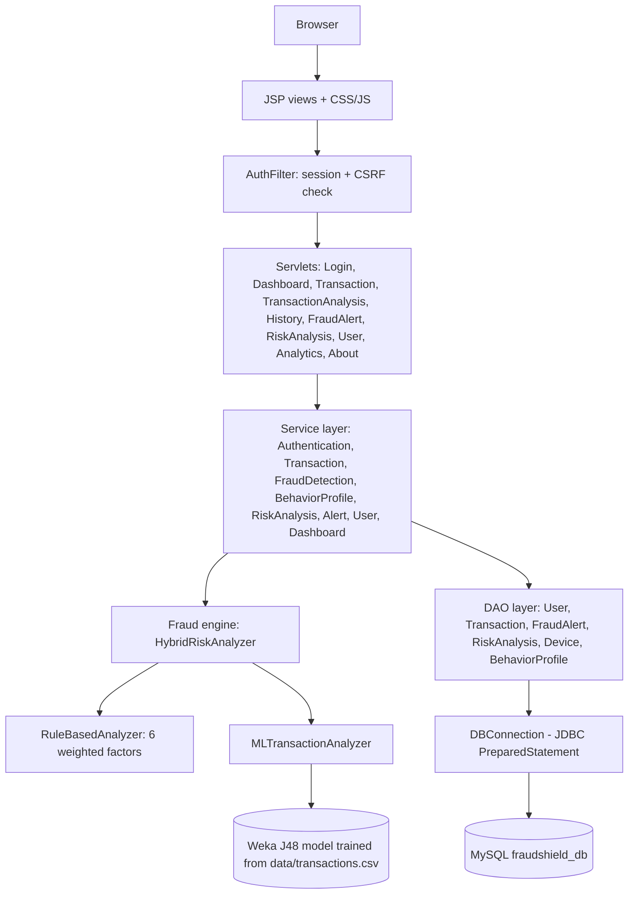
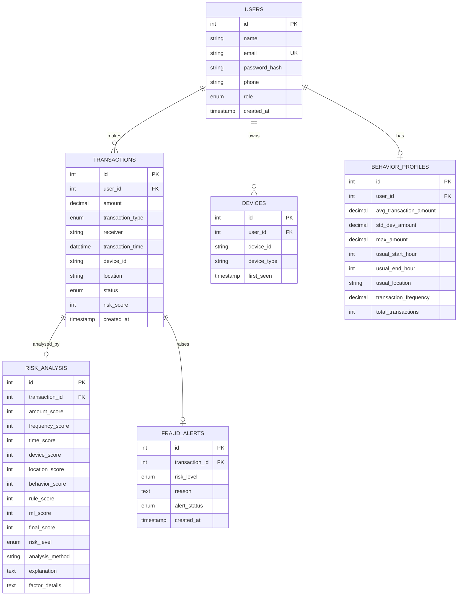
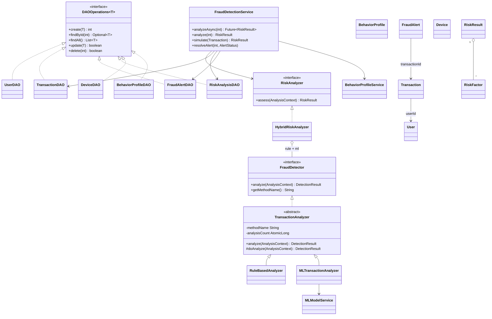
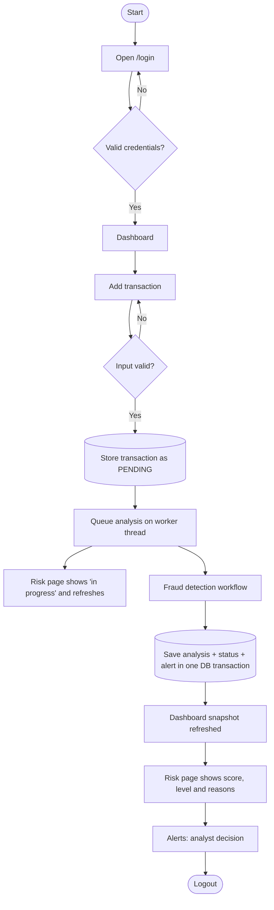
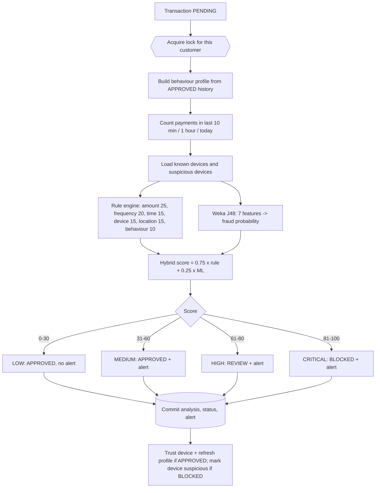
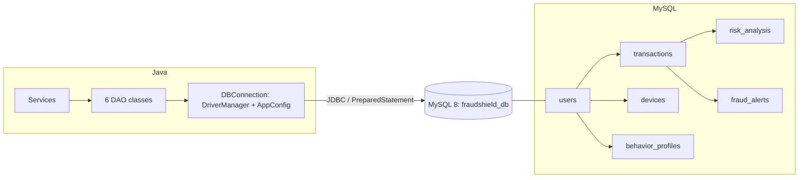
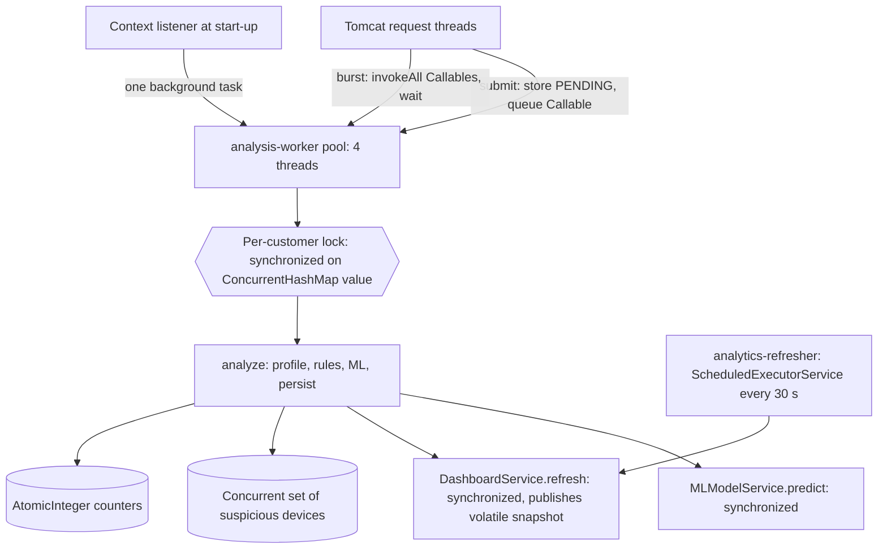

# FraudShield AI - Diagrams (Mermaid)

All diagrams are plain Mermaid and render directly on GitHub, in VS Code (Markdown Preview Mermaid Support) or at https://mermaid.live.
They describe the code as implemented.

## 1. System architecture

## 2. ER diagram

## 3. Class diagram (core classes)

## 4. Application flowchart

## 5. Fraud detection workflow

## 6. Database architecture

## 7. Threading architecture

